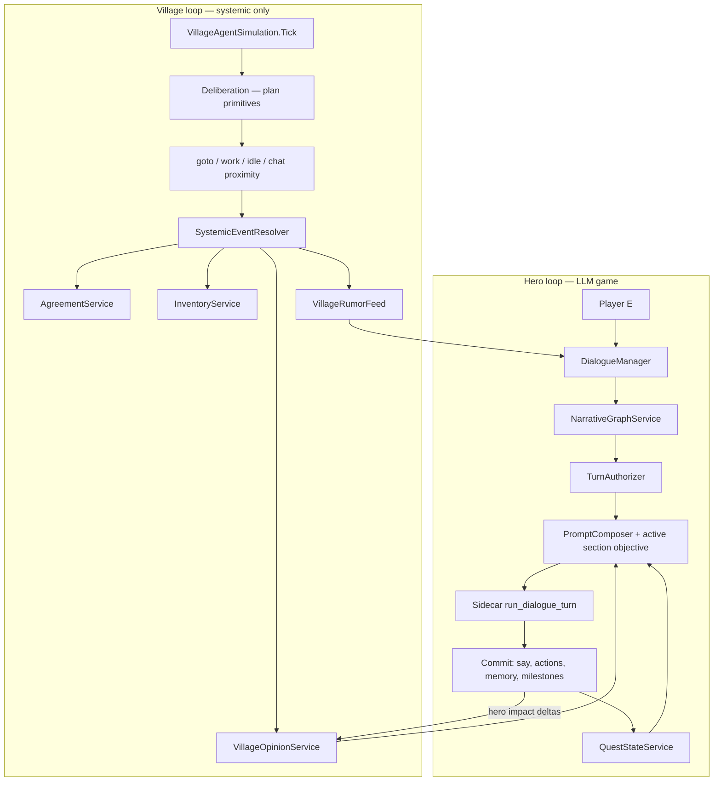

# Option A Redesign Plan: Hero Dialogue as the Game, Village as Consequence Engine

**Status:** In progress — Phase 1 landed via PR (issues #59–#64)

**Confirmed decisions (2026-07-19):**
1. Journal panel for player-visible progression (Phase 5)
2. Keep LLM deliberation
3. Hero dialogue narrowed to 1:1 in Option A
4. ADR 004 documents Option A and supersedes interaction-FSM player-facing scope from ADR 003

---

## 1. Design thesis

| Layer | Role | LLM? |
|-------|------|------|
| **Hero dialogue** | Primary gameplay — negotiation, quests, trade, persuasion, direction | Yes — every hero turn |
| **Village simulation** | Background social physics — movement, opinion, gossip, agreements, inventory | Deliberation only (optional); no simulated NPC↔NPC chat |
| **Consequence surfacing** | Player learns what changed via rumors, UI, NPC attitude, world props | No |

**Principle:** If the player cannot see or act on it, do not run an LLM or fake dialogue for it.

---

## 2. Target architecture



---

## 3. What we keep, shrink, or remove

### Keep (core assets)

| Component | Why |
|-----------|-----|
| `DialogueManager` hero turn path | Player-facing LLM loop |
| `PromptComposer` + `npc_system_template.txt` | Rich context (refined, not deleted) |
| `QuestStateService` + `core_progression.json` | Milestone backbone — evolves into graph state |
| `FailForwardService` | Becomes graph escalation input |
| `AgreementService` | Hire/advice/persuasion contracts from hero dialogue |
| `InventoryService` + `InteractionEffectResolver` | Deterministic item/coin effects from hero-authorized actions |
| `VillageOpinionService` + group asks | Village reacts to hero; mayor/religion/market arcs |
| `NpcMemoryRepository` + summaries | Hero conversation memory |
| `NpcAgentController` + deliberation | NPC movement and coarse plans |
| `AmbientNpcChatterService` | Short template barks (optional, cheap atmosphere) |
| Policy sidecar `run_dialogue_turn` | Validation + policies for hero turns |

### Shrink

| Component | Change |
|-----------|--------|
| `VillageAgentSimulation` | Remove interaction FSM; keep deliberation, gossip budget, opinion hooks |
| `VillageAutonomyDebugPanel` | Replace interaction triggers with systemic event + opinion debug |
| `services/policy_orchestrator` | Drop interaction-specific endpoints; keep dialogue, deliberation, summary |
| `PromptComposer` | Inject **active narrative section** + **authorized next beats** instead of generic “move toward trade/guide” |

### Remove (Option A cut list)

| Component | Reason |
|-----------|--------|
| Interaction FSM (`_activeInteractions`, phases/steps/timeouts) | Fake village drama |
| `engage_dialogue` action type + `InteractionDialogueScript` | Dual dialogue path |
| `NotifyInteractionEngageDialogue` + autonomous coroutines in `DialogueManager` | Background/template/HUD LLM lines |
| `TrySpawnInteractionsFromCurrentChats` + `PickSpawnableInteractionDefinition` | Random social theater |
| `interactions.seed.json` phase DSL (or archive) | Replaced by `village_systemic_events.json` |
| `NpcInteractionMemoryService` (interaction beat memories) | No interaction beats |
| Hero-join-interaction flow (`TryStartNearbyInteractionDialogue` priority) | No joinable FSM |
| Sidecar `run_interaction_line` | No interaction dialogue |
| EditMode tests: `InteractionDialogueScriptTests`, interaction registry epic tests tied to FSM |

---

## 4. New systems (minimal set)

### 4.1 `NarrativeGraphService`

**Purpose:** Single source of truth for “what is this conversation for?”

**Data:** `Assets/StreamingAssets/Dialogue/narrative_graph.json`

```json
{
  "sections": [
    {
      "id": "sec_trade_chain",
      "milestoneId": "m_trade_chain",
      "objective": "Help the hero obtain items needed for the castle push.",
      "entryTriggers": ["milestone:hinted:m_trade_chain"],
      "exitConditions": ["milestone:completed:m_trade_chain"],
      "allowedActionTypes": ["trade", "give_object", "receive_object", "refer_to_npc"],
      "redirectHints": ["Offer a concrete trade or name who has the item."]
    }
  ]
}
```

**Responsibilities:**
- Resolve active section(s) from `QuestStateService` snapshot
- Expose `BuildSectionContextBlock(npcId)` for `PromptComposer`
- Fire on milestone transitions

**Reuse:** `QuestStateService.ApplySignals`, `core_progression.json`, generated `NarrativeSessionCanon.routesByMilestone`

### 4.2 `TurnAuthorizer`

**Purpose:** Post-LLM (or pre-commit) check: did this turn advance the active section?

**Lightweight v1 (deterministic):**
- Parse committed payload: `milestoneSignals`, `proposedNpcActions`, `interactionOutcome`
- If stall count ≥ N for active section → inject escalation block next turn (extends `FailForwardService`)
- Reject/defer illegal actions (already partially in `PolicyRegistry`)

**v2 (optional sidecar):** `run_turn_authorization` returns `{ authorized: bool, redirectHint, sectionProgress }` — only if v1 insufficient

### 4.3 `VillageSystemicEventResolver`

**Purpose:** Replace interaction FSM with deterministic village events driven by NPC state.

**Data:** `Assets/StreamingAssets/Dialogue/village_systemic_events.json`

Event types (examples):
- `opinion_drift_from_gossip` — already exists via gossip queue
- `npc_theft_attempt` — when deliberation goal + opportunity + low opinion
- `group_ask_threshold_reached` — already in `VillageOpinionService`
- `agreement_tick` — payout/errand progress without dialogue
- `relationship_flag_set` — e.g. `npc_a_trusts_npc_b` from sustained high pair affinity (numeric, not LLM)

**Output:** `VillageConsequenceEvent` records → rumor feed + opinion deltas + optional HUD toast

### 4.4 `VillageRumorFeed` + player UI hook

**Purpose:** Player-visible consequence channel.

**Surfaces:**
- Short rumor lines when entering village square (from `VillageOpinionService` + systemic events)
- Per-NPC attitude in dialogue opening (“Mara seems wary since the shrine incident”)
- Optional journal panel: active milestones + recent village events (3–5 lines)

**No LLM required** for rumor text in v1 — template + entity substitution (`{npc}`, `{event}`).

---

## 5. Hero dialogue upgrades (the investment)

### 5.1 Prompt structure (per turn)

Replace generic nudge with **section-scoped objective**:

```
ACTIVE_NARRATIVE_SECTION: sec_trade_chain
SECTION_OBJECTIVE: Help the hero obtain items needed for the castle push.
AUTHORIZED_ACTIONS: trade, give_object, refer_to_npc
STALL_COUNT: 2
REDIRECT_HINT: Name a specific item or NPC who can help.
```

Keep existing persona, memory, inventory, surroundings blocks — but **truncate** low-signal blocks when section is active (context budget discipline).

### 5.2 Opening lines

**Change:** Opening line should reflect **quest state + opinion + last village event**, not only static `openingLine`.

Deterministic v1:
- `BuildContextualOpening(npcId)` reads `QuestStateService`, `VillageOpinionService`, last rumor affecting NPC
- Optional LLM opening only for key story NPCs (flag on `NpcDefinition`)

### 5.3 Conversation outcomes must commit

Every successful hero session should leave at least one of:
- Milestone signal (`hint:` / `unlock:` / `complete:`)
- Agreement record
- Inventory/trade change
- Memory entry
- Opinion delta

If none after N turns → `FailForwardService` forces next-turn redirect block (already partially exists).

### 5.4 Role-sensitive scaffolding (Symbolically Scaffolded Play)

| NPC role | Scaffold level |
|----------|----------------|
| Merchant, quest-giver | Rigid JSON contract + section actions |
| Sidekick | follow_hero rules (existing) |
| Gossip / flavor NPC | Lighter template, no milestone pressure |
| Ghoul | Atmospheric only (existing override) |

Implement via `NpcDefinition.dialogueRole` enum → `PromptComposer` policy profile.

---

## 6. Village autonomy after cut

### Deliberation output (unchanged primitives)

Keep: `goto_location`, `goto_npc`, `chat_with_npc`, `perform_work`, `idle_home`

**Change meaning of `chat_with_npc`:**
- NPCs move into proximity and idle facing each other
- Triggers **gossip processing** + optional **systemic event roll** (theft, alliance, opinion convergence)
- **Does not** spawn interaction FSM or dialogue beats

### Gossip (keep, tune)

`VillageOpinionService` gossip queue remains the main cross-NPC propagation. Increase player visibility:
- When gossip processed, enqueue rumor if magnitude > threshold

### Group asks (keep)

Mayor / religious / market arcs already tie to milestone signals — surface in hero dialogue via `AppendGroupAskContext` (move from debug-only to UI prompt).

---

## 7. Migration map: old interactions → new model

| Old `interactions.seed.json` id | Option A replacement |
|--------------------------------|----------------------|
| `romantic_relationship` | Pair affinity metric + rumor; hero learns via gossip; romance only in hero dialogue |
| `bribe` / errand | `AgreementService` from hero negotiation only |
| `steal` | Systemic event: NPC attempts steal when conditions met; rumor + inventory change |
| `elect_mayor` | Existing group ask + hero dialogue section |
| `start_cult` | Piety/leadership tracks + group ask variant |
| `perform_service` | Agreement primitive + work plan step |

---

## 8. Implementation phases

### Phase 0 — Baseline & success metrics (1–2 days)

- [ ] Record playtest script: 3 hero conversations, 10 min village observation
- [ ] Metrics: % hero turns with world state change; player-reported “conversation went somewhere” (subjective); EditMode test count baseline
- [ ] Feature flag: `VillageSimulationMode.LegacyInteractionFsm | SystemicOnly`

### Phase 1 — Stop the bleeding (3–5 days)

**Goal:** Disable fake village dialogue without breaking hero talk.

- [ ] Add `SystemicOnly` flag; when on, skip `TrySpawnInteractionsFromCurrentChats`, `_activeInteractions` tick, all `NotifyInteractionEngageDialogue` callers
- [ ] Remove hero-join-interaction priority from `PlayerInteractor` (E always opens direct NPC dialogue)
- [ ] Delete or no-op `CoRunBackgroundInteractionDialogueBeat` path
- [ ] Keep F8 panel but gray out interaction sections with “deprecated under Option A”
- [ ] Tests: hero dialogue EditMode suite still green

**Exit criteria:** No HUD lines of form “Alice and Bob continue Romantic Relationship (loop)”.

### Phase 2 — Village systemic layer (5–7 days)

- [ ] Add `village_systemic_events.json` + `VillageSystemicEventResolver`
- [ ] Wire `chat_with_npc` proximity → gossip + event roll (deterministic)
- [ ] Add `VillageRumorFeed` + persist last N events
- [ ] Inject rumor/opinion into `BuildContextualOpening` and `PromptComposer` FACTS block
- [ ] Tests: systemic event triggers, rumor generation, opinion propagation

**Exit criteria:** Observing village for 5 min shows rumor/attitude changes without fake dialogue.

### Phase 3 — Narrative graph v1 (5–7 days)

- [ ] Add `narrative_graph.json` aligned to `core_progression.json` milestones
- [ ] Implement `NarrativeGraphService`; wire to `QuestStateService`
- [ ] `PromptComposer` injects active section block
- [ ] Tests: section resolution per milestone state; prompt block content

**Exit criteria:** Hero prompt explicitly states current section objective for active milestone.

### Phase 4 — Turn authorization & fail-forward (3–5 days)

- [ ] Implement `TurnAuthorizer` v1 (deterministic)
- [ ] Connect `FailForwardService` stall counts to section escalation hints
- [ ] Telemetry: log turns without progress per section
- [ ] Tests: stall → redirect hint; action rejection

**Exit criteria:** After 3 non-progress turns, NPC opening/prompt includes concrete redirect.

### Phase 5 — Player-facing UI (3–5 days)

- [ ] Journal or HUD strip: active milestones (from `QuestStateService.Snapshot`)
- [ ] Rumor toast on significant village events
- [ ] Dialogue UI: show NPC attitude snippet under name
- [ ] Optional: group ask prompt when villager approaches hero

**Exit criteria:** Player can answer “what should I do next?” from UI without F8 debug.

### Phase 6 — Delete legacy code & slim sidecar (3–5 days)

- [ ] Remove interaction FSM code paths behind flag (then delete)
- [ ] Remove `InteractionDialogueScript`, interaction seed phases, obsolete tests
- [ ] Drop `run_interaction_line` from Python orchestrator
- [ ] Update ADR 004 (supersedes interaction pipeline scope for Option A)
- [ ] README architecture section rewrite

**Exit criteria:** `VillageAgentSimulation` drops ~40% interaction-related code; test suite green.

### Phase 7 — Content pass & playtest (ongoing)

- [ ] Per-NPC `dialogueRole` assignment
- [ ] One narrative section per core milestone + 2 village arc sections (mayor, cult)
- [ ] Tune systemic event rates for “alive but not chaotic”
- [ ] Full playthrough: trade → followers → castle

---

## 9. Risk register

| Risk | Mitigation |
|------|------------|
| Village feels *too* quiet after cut | Rumor feed + visible opinion shifts + NPC movement; tune event rates |
| Hero prompt still unfocused | Section block + TurnAuthorizer + shorter context |
| Over-delete breaks agreements/trades | Keep `InteractionEffectResolver` for hero action execution |
| Deliberation proposes interactions that no longer exist | Remove interaction proposal path from deliberation envelope handling |
| Large refactor breaks tests | Phase behind `SystemicOnly` flag; delete only in Phase 6 |

---

## 10. Out of scope (Option A)

- NPC↔NPC LLM dialogue (even cheap) — explicitly deferred
- Multi-party hero dialogue overhaul — keep existing but don’t expand
- Full SENNA-style multi-agent sidecar — v2 if TurnAuthorizer v1 fails
- CI/GitHub Actions — separate track

---

## 11. Decision log (to record in ADR 004)

1. Village social drama is **systemic + rumor**, not simulated conversation.
2. Hero dialogue is the **only** LLM conversation surface.
3. Milestones + narrative graph sections drive **direction**; FailForward handles stalls.
4. Interaction DSL FSM is **retired**; effects stay in resolver for hero actions.

---

## 12. Suggested first PR (tracer bullet)

**Title:** `feat: add SystemicOnly flag and disable interaction FSM spawn`

**Scope:**
- `VillageAgentSimulation`: flag gates spawn + tick of `_activeInteractions`
- `PlayerInteractor`: E → direct dialogue only
- No new systems yet; proves Phase 1 safely

**Test plan:** EditMode hero dialogue tests; manual — no background interaction HUD spam
