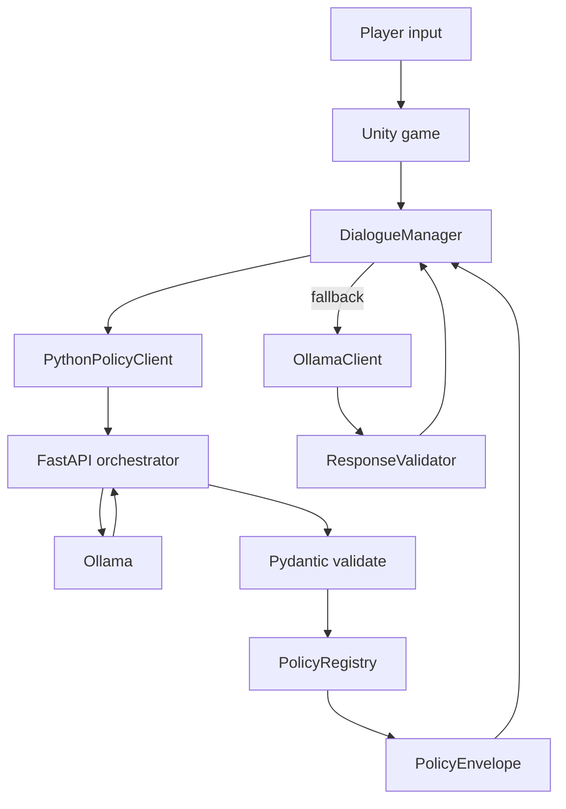

# RPG — LLM-driven Unity island adventure

A **Unity 6** fantasy RPG where NPC conversations, quest progression, and session narrative are driven by a local **LLM** (Ollama). A **Python policy orchestrator** sidecar validates JSON contracts, enforces NPC-type policies, and keeps Unity and the model aligned on the same wire shapes.

The git repo tracks **scripts, dialogue data, and minimal Unity configs** (~2 MB). 3D/audio Asset Store packs are imported locally after clone — see [DEV_SETUP.md](DEV_SETUP.md) for the full fresh-clone checklist.

---

## What you get

- **Island exploration** — NavMesh movement, wildlife, hazards (tigers, spiders, underwater death), hunger, spell books, castle/warehouse locations.
- **LLM dialogue** — Per-NPC personas, memory, conversation summaries, inventory-aware prompts, proposed NPC actions (trade, guide, follow).
- **Procedural narrative canon** — Session seed, milestones, trade requirements, and fail-forward when the player stalls.
- **Policy layer** — Pydantic models as the single source of truth for dialogue turn JSON; generated schemas and pytest guardrails.

---

## Architecture (zoom-out)

Three cooperating layers:



| Layer | Role | Key paths |
|-------|------|-----------|
| **Unity game** | Gameplay, UI, persistence, prompt assembly, action execution | `Assets/Scripts/` |
| **Policy orchestrator** | HTTP API, LLM calls, tolerant parse → strict validate, NPC policy | `services/policy_orchestrator/` |
| **Ollama** | Local (or cloud) chat model | `http://127.0.0.1:11434` default |

**Preferred path:** Unity posts a `DialogueTurnRequest` to `POST /v1/dialogue/turn`; the sidecar builds the Ollama prompt, parses messy model JSON into `LlmDialogueOutput`, applies `PolicyRegistry` rules, and returns a `PolicyEnvelope`.

**Fallback path:** Unity calls Ollama directly via `OllamaClient` + `ResponseValidator` when `usePythonPolicyOrchestrator` is off in `DefaultOllamaSettings`.

---

## Module map

Domain vocabulary aligned with the dialogue pipeline and recent refactors.

### `Rpg.Dialogue` — conversation hub

| Module | Responsibility |
|--------|----------------|
| `DialogueManager` | Singleton hub: session lifecycle, turn submission, UI callbacks, debug commands |
| `DialogueSession` / `DialogueUIController` | Transcript windowing and presentation |
| `PythonPolicyClient` / `PythonPolicyDtos` | HTTP to sidecar (`8787`) |
| `OllamaClient` / `PromptComposer` | Direct LLM path and system-prompt assembly |
| `ResponseValidator` | Tolerant JSON parse; mirrors `dialogue_parsing.py` |
| `CommitSuccessfulTurn` path | Shared post-turn commit (session, memory, transcript, fail-forward) |
| `DialogueTurnCommitLogic` | Pure fail-forward + willingness helpers (EditMode tested) |
| `NpcActionExecutor` | Runs proposed actions (move, trade, give/receive, follow) |
| `InventoryService` / `QuestStateService` / `FailForwardService` | Economy, milestones, stall recovery |
| `NarrativeGenerationService` | Session canon from seed + LLM or fallback scaffold |
| `ChickenTheftDialogueScenario` | Scenario-specific theft confrontation state |
| `SidekickFollowActionSynthesizer` | Heuristic `follow_hero` when model omits action |
| `NpcActionTypes` | Constants aligned with Python `PolicyRegistry` |

### `Rpg.Npc` — world characters

NPC bindings (`NpcDialogueBinding`), definitions (`NpcDefinition`), ambient AI, ghoul menace, sidekick follow, chicken theft confrontation, guide-to-location.

### `Rpg.Player` — hero

Click-to-move (`PlayerClickMove`), interact (`PlayerInteractor` → `DialogueManager.TryStartDialogue`), combat, hunger, pickups, underwater death.

### `Rpg.UI` — screens and HUD

Title screen (Ollama local/cloud selection), dialogue panel, intro overlay, health bar, game over.

### `Rpg.Core` / `Rpg.GameState` / `Rpg.Gameplay`

`RuntimeLevelBootstrap` wires systems at play; world state (year acknowledgment); castle/portals and level tooling.

### `services/policy_orchestrator` — contract layer

| Module | Responsibility |
|--------|----------------|
| `app/models.py` | **Canonical** Pydantic models (`StrictCamelModel` inbound, `CamelModel` LLM/outbound) |
| `app/orchestrator.py` | Turn / summary / narrative orchestration |
| `app/dialogue_parsing.py` | Forgiving LLM JSON → `LlmDialogueOutput` |
| `app/policies.py` | NPC-type allow-lists (normal, sidekick, ghoul) |
| `app/schema_export.py` | Generates `Assets/StreamingAssets/Dialogue/schema/*.json` |

---

## Dialogue turn (happy path)

1. **Trigger** — `PlayerInteractor` (E) → `DialogueManager.TryStartDialogue`
2. **Player line** — `DialogueUIController` → `SubmitPlayerLineFromUi` → `SubmitPlayerLineAsync`
3. **Context** — World facts, memory, summary, inventory, surroundings, narrative canon, recent turns → `PythonDialogueTurnRequestDto`
4. **Sidecar** — `POST /v1/dialogue/turn` → Ollama → `parse_dialogue_output` → `LlmDialogueOutput.model_validate` → policy normalize → `PolicyEnvelope`
5. **Unity** — `ResponseValidator.BuildPayloadFromDialogueDto` → `CommitSuccessfulTurn` → UI, memory, transcript, `NpcActionExecutor` (transfers queued for player accept/decline)

---

## Quick start

### Prerequisites

- Unity **6000.4.x** (`ProjectSettings/ProjectVersion.txt`)
- [Ollama](https://ollama.com/) with a chat model, e.g. `ollama pull llama3.2`
- Python 3.x for the sidecar (optional but recommended)

### Run the sidecar

```bash
cd services/policy_orchestrator
python -m venv .venv && source .venv/bin/activate
pip install -r requirements.txt
uvicorn app.main:app --host 127.0.0.1 --port 8787 --reload
```

### Configure Unity

1. Open the project in Unity 6000.4.x.
2. Enable orchestrator flags on `Assets/Resources/DefaultOllamaSettings.asset`: `usePythonPolicyOrchestrator`, `usePythonSummaryService`, `usePythonNarrativeGeneration`.
3. Start Ollama; confirm `http://127.0.0.1:11434` is reachable.

### Play

| Scene | Use |
|-------|-----|
| `Assets/sc2.unity` | Full island (primary build scene) |
| `Assets/Scenes/Room_Prototype.unity` | Dialogue prototype slice |

**Controls:** left-click move · **E** talk · **Enter** send line · **Escape** close dialogue

For Asset Store imports, Resources mirrors, Mixamo, and music — follow **[DEV_SETUP.md](DEV_SETUP.md)**.

---

## Repository layout

| Path | Contents |
|------|----------|
| `Assets/Scripts/` | C# game code (`Rpg.*` namespaces) |
| `Assets/StreamingAssets/Dialogue/` | Prompt templates, world/npc JSON, generated schemas |
| `Assets/Resources/` | Runtime settings (`DefaultOllamaSettings`), UI prefabs, build mirrors |
| `Assets/Editor/Tests/EditMode/` | NUnit tests for pure dialogue logic |
| `services/policy_orchestrator/` | FastAPI sidecar + pytest suite |
| `DEV_SETUP.md` | Fresh clone, Asset Store, Resources, playtest |
| `MISSION.md` | Learning focus: Pydantic contract layer |
| `docs/agents/` | Issue tracker and triage conventions |

**Git ignores** most `Assets/**` vendor art; only scripts, dialogue data, and selected configs are tracked.

---

## Contracts and schemas

- **Source of truth:** `services/policy_orchestrator/app/models.py`
- **Generated artifacts:** `Assets/StreamingAssets/Dialogue/schema/` (run `python scripts/generate_schemas.py`)
- **Sync test:** `pytest` → `test_schema_sync.py` fails if schemas drift
- **Unity mirror:** `ResponseValidator.cs` + `PythonPolicyDtos.cs` consume the same camelCase shapes

Inbound Unity requests use `StrictCamelModel` (`extra="forbid"`). LLM output uses tolerant parsing then `CamelModel` validation.

---

## Development

### Python tests

```bash
cd services/policy_orchestrator && source .venv/bin/activate && pytest
```

### Unity tests

Open **Window → General → Test Runner → EditMode** (requires `com.unity.test-framework` in `Packages/manifest.json`).

### Issues and agents

GitHub Issues: [aaorsi/rpg](https://github.com/aaorsi/rpg). Agent workflow docs: `AGENTS.md`, `docs/agents/issue-tracker.md`.

---

## Further reading

- [DEV_SETUP.md](DEV_SETUP.md) — complete setup, asset packs, authoring
- [services/policy_orchestrator/README.md](services/policy_orchestrator/README.md) — API endpoints
- [MISSION.md](MISSION.md) — Pydantic learning mission for this repo
