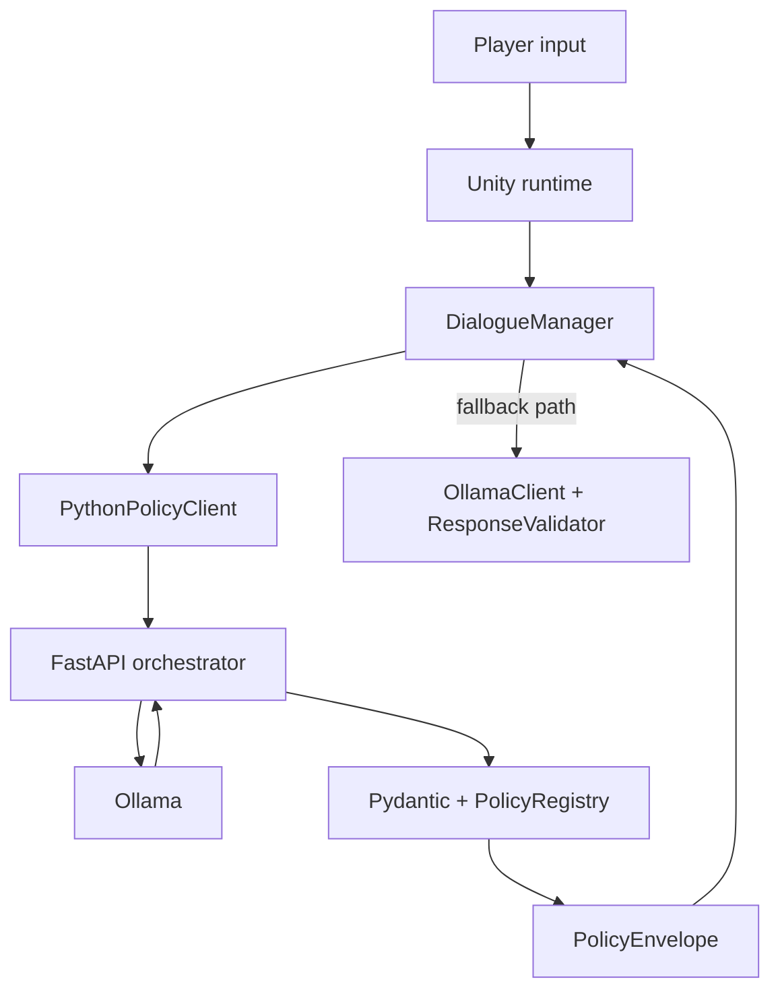

# RPG - A Living Island Village

Step into a fantasy island where every villager has a voice, a memory, and an agenda - then decide whether you will become their trusted ally, their paid strategist, their political symbol, or the outsider who reshapes the village by force of personality.

A Unity fantasy RPG where villagers are no longer static quest terminals - they remember, plan, gossip, negotiate, and react to how the hero behaves.

You can still explore, fight, and discover the island, but the heart of the game is now social: your conversations and deals with villagers can reshape village politics and story direction.

---

## What This Game Feels Like

You wake up on a mysterious island with a populated village nearby.

- Talk to NPCs who have their own style, goals, and motives.
- Make deals: hire people, give advice, persuade, trade, or refuse.
- Watch villagers react to each other, not just to you.
- Build (or lose) reputation over time through your choices.

This repo tracks scripts, dialogue data, and lightweight Unity config. Art/audio packs are imported locally after clone (see [DEV_SETUP.md](DEV_SETUP.md)).

---

## New Autonomy Features (Latest Update)

The village now runs as a lightweight social simulation:

- **Persistent personas** for villagers (personality, traits, goals, capabilities).
- **Budgeted autonomy loop** where villagers deliberate and execute plans over time.
- **Structured social outcomes** from dialogue (`offer_task`, `accept_task`, `advice_given`, `persuasion`, `payment`).
- **Agreement lifecycle** for contracts like hire/advice/persuasion with payout handling.
- **Village opinion and gossip propagation** with bounded spread.
- **Standing-driven group asks** (for example, villagers asking you to run for mayor or take a religious leadership role).
- **Ambient villager chatter** generated from persona + sentiment context.
- **Debug panel + telemetry** to inspect autonomy behavior live during play.

---

## What You Can Do In-Game

### Direct interactions

- Start conversations and negotiate terms.
- Hire NPCs for tasks and pay with goods/coin.
- Offer strategic advice and see whether NPCs adopt it.
- Persuade skeptical villagers and monitor changing sentiment.
- Guide sidekicks or receive support from them.

### Emerging village dynamics

- Villagers exchange opinions and influence each other through gossip.
- NPC-to-NPC chatter makes village life visible even when you are not talking.
- Strong reputation in specific tracks (leadership, piety, wealth, helpfulness) unlocks group-level asks.
- Your choices can shift long-term social direction, not just immediate dialogue outcomes.

### Example moments

- You help enough villagers, and a leadership movement forms around your candidacy.
- You solve disputes with payments or mediation, improving helpfulness and wealth perception.
- You earn trust with one faction but become controversial with another.

---

## Quick Start

### Prerequisites

- Unity **6000.4.x** (`ProjectSettings/ProjectVersion.txt`)
- [Ollama](https://ollama.com/) with a chat model, for example `llama3.2`
- Python 3.x (recommended for sidecar services)

### Run the policy sidecar

```bash
cd services/policy_orchestrator
python -m venv .venv && source .venv/bin/activate
pip install -r requirements.txt
uvicorn app.main:app --host 127.0.0.1 --port 8787 --reload
```

### Configure Unity and play

1. Open the project in Unity 6000.4.x.
2. In `Assets/Resources/DefaultOllamaSettings.asset`, enable:
   - `usePythonPolicyOrchestrator`
   - `usePythonSummaryService`
   - `usePythonNarrativeGeneration`
3. Ensure Ollama is reachable at `http://127.0.0.1:11434`.
4. Open `Assets/sc2.unity` and press Play.

Controls: left-click move, **E** interact, **Enter** send line, **Escape** close dialogue.

---

## Architecture (Introduced Gradually)

If you are only here to play or tweak content, you can skip this section.

At a high level:

1. **Unity** handles world simulation, UI, inventory, and action execution.
2. **Python policy orchestrator** validates and normalizes model output.
3. **Ollama** provides dialogue/deliberation generation.



The sidecar is the preferred path. A direct Unity fallback path still exists for resilience.

---

## Core Runtime Loops

### Dialogue loop

1. Player speaks to NPC.
2. Unity builds context (facts, memory, summary, inventory, surroundings).
3. Sidecar validates model response and applies NPC-type policy.
4. Unity commits results (dialogue, actions, agreements, milestones, memory).

### Village autonomy loop

`VillageAgentSimulation` periodically:

- refreshes villager participants,
- processes gossip interactions,
- schedules one deliberation at a time (cadence budget),
- applies plan results to `NpcAgentController`.

This keeps behavior dynamic without overwhelming local hardware.

---

## Operational Limits and Safety Behavior

- One deliberation is allowed in flight at a time.
- Plan steps are capped before application.
- Gossip processing uses per-tick budget limits.
- If sidecar output is invalid or unavailable, deterministic fallback behavior is applied.
- Request contracts are strict on input (`StrictCamelModel`) to fail fast on drift.

Known tradeoff: prolonged sidecar failure keeps villagers stable but can make behavior temporarily stale.

---

## Repository Guide

| Path | What is here |
|------|---------------|
| `Assets/Scripts/` | Unity gameplay + autonomy code (`Rpg.*`) |
| `Assets/StreamingAssets/Dialogue/` | Prompt templates and dialogue schemas |
| `Assets/Editor/Tests/EditMode/` | Unity EditMode tests |
| `services/policy_orchestrator/` | FastAPI sidecar and pytest suite |
| `DEV_SETUP.md` | Full setup including asset imports |

---

## Testing

### Python

```bash
cd services/policy_orchestrator
source .venv/bin/activate
pytest
```

### Unity

Use **Window -> General -> Test Runner -> EditMode**.

---

## Further Reading

- [DEV_SETUP.md](DEV_SETUP.md) - full setup and content pipeline
- [services/policy_orchestrator/README.md](services/policy_orchestrator/README.md) - API details
- [MISSION.md](MISSION.md) - project learning context
